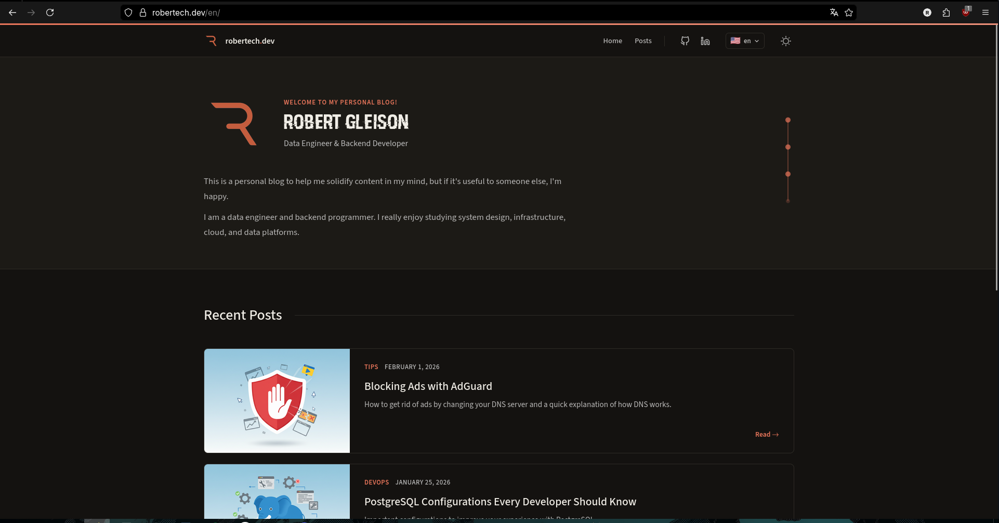
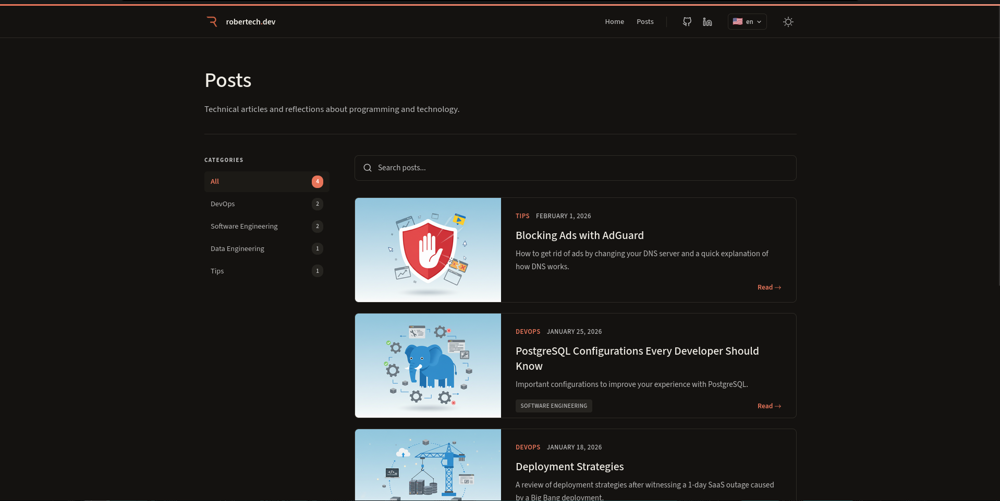
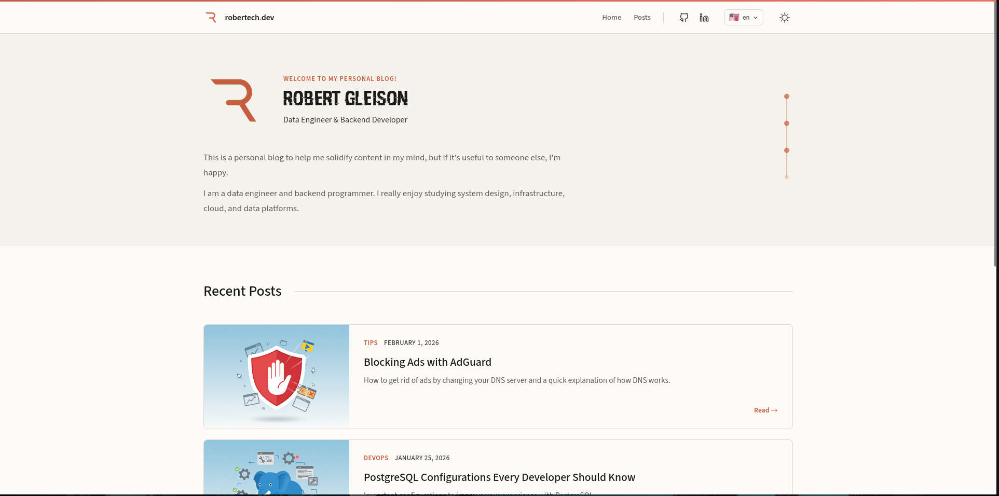
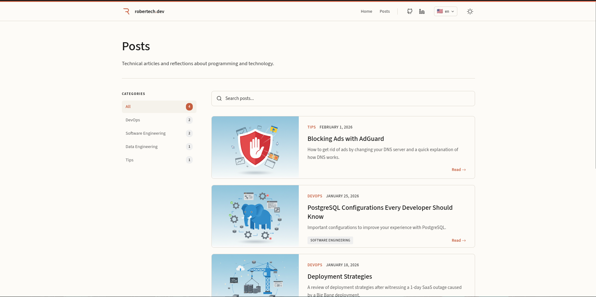

# Personal Blog
This is my personal blog where I keep my articles. You can visit it at [robertech.dev](https://robertech.dev/)

## Commands

All commands are run from the root of the project:

| Command | Action |
| :-- | :-- |
| `pnpm install` | Install dependencies |
| `pnpm dev` | Start local dev server at `localhost:4321` |
| `pnpm build` | Build production site to `./dist/` |
| `pnpm preview` | Preview build locally before deploying |
| `pnpm astro ...` | Run Astro CLI commands |

Note: you need to have Node installed

## Creating Blog Posts

Blog posts are written in Markdown and stored in:

- `src/content/posts/pt-br/` — Portuguese posts
- `src/content/posts/en/` — English posts

### Frontmatter

Every post must include frontmatter at the top:

```markdown
---
title: 'Your Post Title'
pubDate: 2024-01-15
description: 'A brief description of your post for SEO and previews'
author: 'Robert Gleison'
image:
  url: '/post-slug/thumb.png'
  alt: 'Description of the image'
tags: ["Tips"]
---
```

Available tags: `Tips`, `Data Engineering`, `DevOps`, `Software Engineering`

### Claude Code Skills

This project includes Claude Code skills to help write and manage posts:

| Command | Action |
| :-- | :-- |
| `/create-post-template` | Scaffold a new blog post |
| `/review-post` | Review a post for structure, content, and style issues |
| `/translate-post-pt-to-en` | Translate a post from Portuguese to English |
| `/translate-post-en-to-pt` | Translate a post from English to Portuguese |

Skills are located in `.claude/skills/`.

# Site



